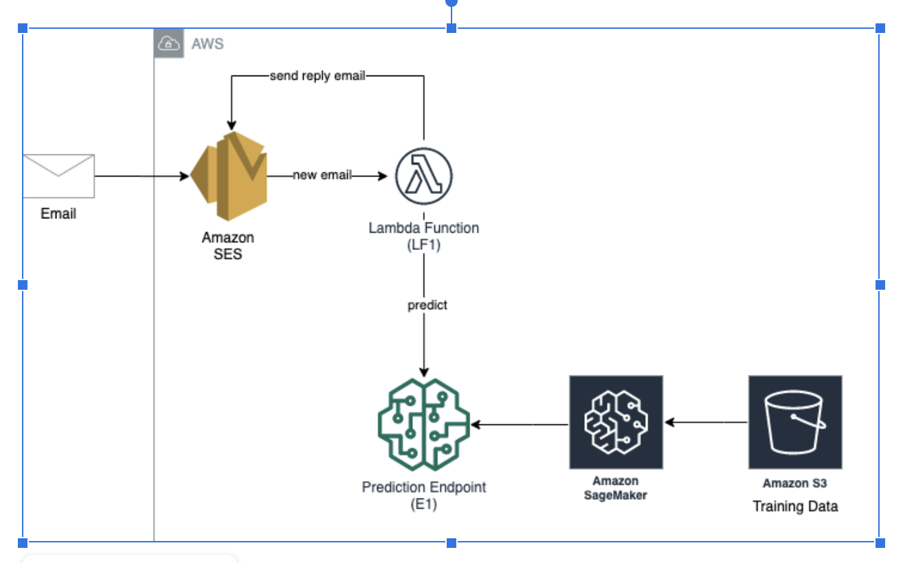

# COMSE6998 Assignment 3: Spam Detection

## Inroduction
This project is to implement a machine learning model to predict whether a message is spam or not. Furthermore, a system will be created for the task that upon receipt of an email message, it will automatically flag it as spam or not, based on the prediction obtained from the machine learning model.

## Architecture

## Instruction
1. Create one CloudFormations called "COMSE6998-HW3-SpamDetection-T1" on the Console using empty/nullresource template.
2. The whole architecture is in samTemplate, updated by CodePipeline "hw3-spam-detection" and CodeBuild "hw3-spam-detection-lambda-build-project" via GitHub.
3. Commit GitHub repo to get the auto deployment.
4. Do modify the hard-coded code such as
   - S3 bucket in Lambda, notebook if required
   - Env parameters of endpoint name if required

## Note
1. Keep notebook "hw3-spam-detection-training". It initializes a model.
2. Keep S3 "hw3-spam-detection-training". It stores files for notebook "hw3-spam-detection-training".
3. Keep notebook Status to be "InService" to be run from lambda retrain process.
4. Remember to deactivate SES rule set when deleting CF since the "activateSesReceiptRuleSetLambdaFunction" is invoked by creating/deleting template.
